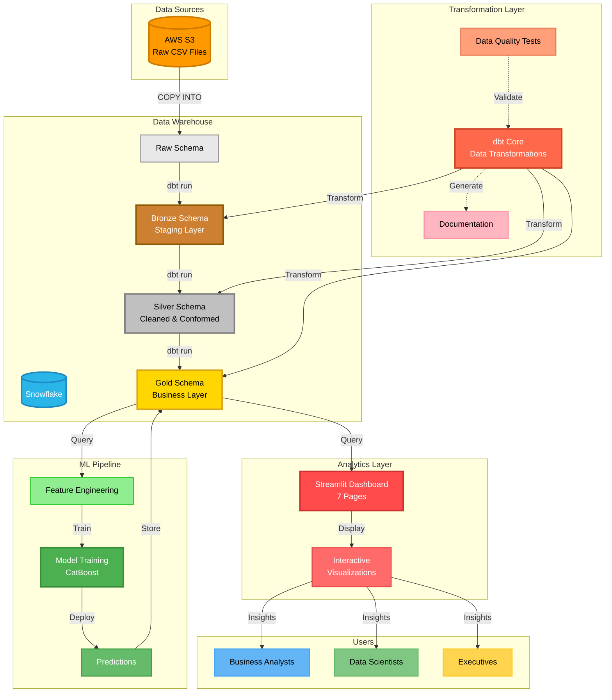
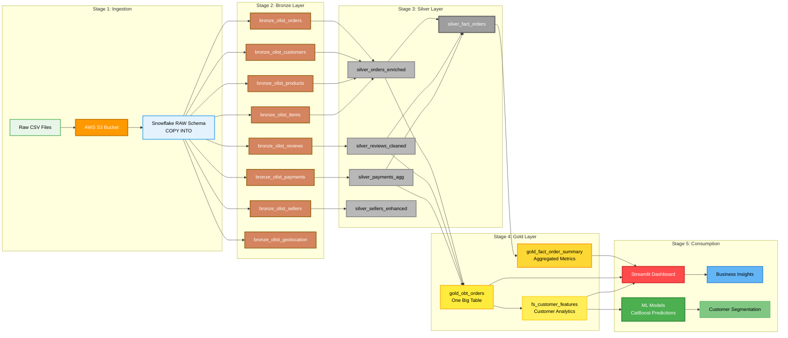

# 🚀 Brazilian E-Commerce Data Engineering Project

[](https://www.getdbt.com/)
[](https://www.snowflake.com/)
[](https://aws.amazon.com/)
[](https://www.python.org/)
[](https://streamlit.io/)

A comprehensive end-to-end data engineering pipeline built on modern cloud infrastructure, featuring data ingestion from AWS S3, transformation using dbt, warehousing in Snowflake, machine learning predictions, and interactive analytics dashboards.

## 📚 Interactive Documentation

**[🌐 View Interactive Documentation](https://hakkache.github.io/Data_Engineering_Project_AWS_DBT_SNOWFLAKE/)** - Explore the complete architecture, data flow, and system components through our interactive documentation site.

## 📋 Table of Contents

- [Overview](#overview)
- [Architecture](#architecture)
- [Data Flow](#data-flow)
- [Project Structure](#project-structure)
- [Technology Stack](#technology-stack)
- [Features](#features)
- [Setup & Installation](#setup--installation)
- [Usage](#usage)
- [Data Models](#data-models)
- [Dashboard](#dashboard)
- [Machine Learning Pipeline](#machine-learning-pipeline)
- [Contributing](#contributing)

## 🎯 Overview

This project demonstrates a production-ready data engineering solution for analyzing **[Brazilian E-Commerce Public Dataset](https://www.kaggle.com/datasets/olistbr/brazilian-ecommerce)** (2016-2018) from Kaggle/Olist. The pipeline ingests raw data from AWS S3, transforms it through bronze/silver/gold layers using dbt, stores it in Snowflake, runs ML models for predictions, and visualizes insights through an interactive Streamlit dashboard.

**Key Highlights:**
- ✅ **100K+ orders** processed across 3 years
- ✅ **8 source tables** integrated from Brazilian e-commerce marketplace
- ✅ **3-tier medallion architecture** (Bronze → Silver → Gold)
- ✅ **20+ dbt models** with data quality tests
- ✅ **Interactive dashboard** with 7 analytics pages
- ✅ **ML pipeline** for customer behavior prediction

## 🏗️ Architecture



## 🔄 Data Flow



## 📁 Project Structure

```
dbt_snowflake/
├── aws_dbt_snowflake_project/     # dbt project
│   ├── models/
│   │   ├── sources/               # Source definitions
│   │   ├── bronze/                # Raw staging models (8 tables)
│   │   ├── silver/                # Cleaned & conformed models
│   │   └── gold/                  # Business-ready models
│   │       ├── gold_fact_order_summary.sql
│   │       ├── gold_obt_orders.sql
│   │       └── fs_customer_features.sql
│   ├── macros/                    # Custom dbt macros
│   │   ├── business_logic.sql
│   │   ├── data_quality.sql
│   │   └── generate_surrogate_key.sql
│   ├── tests/                     # Data quality tests
│   ├── dbt_project.yml
│   └── profiles.yml
│
├── dashboard/                     # Streamlit analytics dashboard
│   ├── app.py                     # Main dashboard app
│   ├── pages/
│   │   ├── overview.py            # KPIs & trends
│   │   ├── sales_analytics.py    # Revenue analysis
│   │   ├── customer_analytics.py # Customer segmentation
│   │   ├── product_analytics.py  # Product performance
│   │   ├── delivery_performance.py # Logistics metrics
│   │   ├── payment_analytics.py  # Payment insights
│   │   └── review_analytics.py   # Customer feedback
│   ├── utils/
│   │   ├── snowflake_connector.py # DB connection
│   │   └── data_loader.py        # SQL queries
│   ├── .streamlit/
│   │   └── config.toml           # Snowflake theme
│   └── requirements.txt
│
├── ml_pipeline/                   # Machine learning pipeline
│   ├── notebooks/
│   │   ├── 01_eda.ipynb          # Exploratory analysis
│   │   ├── 02_feature_engineering.ipynb
│   │   └── 03_model_training.ipynb
│   ├── src/
│   │   ├── load_training_data.py
│   │   ├── train_model.py
│   │   └── predict.py
│   ├── models/                    # Trained model artifacts
│   └── .env                       # Environment variables
│
└── logs/                          # Execution logs
```

## 🛠️ Technology Stack

### Data Infrastructure
- **Cloud Storage**: AWS S3
- **Data Warehouse**: Snowflake
- **Transformation**: dbt Core 1.7.x
- **Orchestration**: Manual / Airflow (optional)

### Analytics & ML
- **Dashboard**: Streamlit 1.31.0
- **Visualization**: Plotly 5.18.0
- **ML Framework**: CatBoost, scikit-learn
- **Data Processing**: pandas 2.1.4, NumPy

### Development
- **Language**: Python 3.11.3
- **Package Manager**: Poetry / pip
- **Version Control**: Git / GitHub
- **IDE**: VS Code

## ✨ Features

### Data Pipeline
- ✅ **Automated ELT**: Raw data → Bronze → Silver → Gold
- ✅ **Incremental Loading**: Efficient data processing
- ✅ **Data Quality Checks**: 15+ dbt tests for data integrity
- ✅ **Documentation**: Auto-generated data lineage & docs

### Analytics Dashboard
- 📊 **Overview Page**: High-level KPIs and trends
- 💰 **Sales Analytics**: Revenue trends, order analysis
- 👥 **Customer Analytics**: LTV, segmentation, behavior
- 📦 **Product Analytics**: Category performance, pricing
- 🚚 **Delivery Performance**: State-level logistics metrics
- 💳 **Payment Analytics**: Payment methods, installments
- ⭐ **Review Analytics**: Sentiment analysis, ratings

### Machine Learning
- 🤖 **Customer Segmentation**: Automatic customer clustering
- 📈 **Churn Prediction**: Customer retention forecasting
- 🎯 **Recommendation Engine**: Product recommendations
- 📊 **Feature Store**: Engineered features in Snowflake

## � Data Source

### Brazilian E-Commerce Public Dataset by Olist

**Dataset URL**: [https://www.kaggle.com/datasets/olistbr/brazilian-ecommerce](https://www.kaggle.com/datasets/olistbr/brazilian-ecommerce)

**About the Dataset**:
This is a Brazilian e-commerce public dataset of orders made at Olist Store. The dataset has information of 100k orders from 2016 to 2018 made at multiple marketplaces in Brazil. Its features allow viewing an order from multiple dimensions: from order status, price, payment and freight performance to customer location, product attributes and finally reviews written by customers.

**Dataset Contents**:
- 📊 **99,441 orders** with complete information
- 👥 **99,441 unique customers**
- 🏪 **3,095 sellers**
- 📦 **32,951 products** across 73 categories
- 🌍 **4,119 cities** across 27 Brazilian states
- ⭐ **99,224 customer reviews** with ratings and comments
- 💳 **103,886 payment records** (multiple payments per order)

**Data Tables**:
1. `olist_orders_dataset.csv` - Order information
2. `olist_customers_dataset.csv` - Customer details
3. `olist_order_items_dataset.csv` - Items purchased in each order
4. `olist_order_payments_dataset.csv` - Payment methods and values
5. `olist_order_reviews_dataset.csv` - Customer reviews and ratings
6. `olist_products_dataset.csv` - Product catalog
7. `olist_sellers_dataset.csv` - Seller information
8. `olist_geolocation_dataset.csv` - Brazilian zip codes with lat/lng
9. `product_category_name_translation.csv` - Portuguese to English translation

**License**: Public Domain (CC0: Public Domain)

## �🚀 Setup & Installation

### Prerequisites
```bash
# Required software
- Python 3.11+
- dbt Core 1.7+
- Snowflake account
- AWS account (for S3)
```

### 1. Clone Repository
```bash
git clone https://github.com/hakkache/Data_Engineering_Project_AWS_DBT_SNOWFLAKE.git
cd dbt_snowflake
```

### 2. Install dbt Dependencies
```bash
cd aws_dbt_snowflake_project
pip install dbt-core dbt-snowflake
dbt deps
```

### 3. Configure Snowflake Credentials
```bash
# Edit profiles.yml
nano profiles.yml

# Or use environment variables
export SNOWFLAKE_ACCOUNT=your_account
export SNOWFLAKE_USER=your_user
export SNOWFLAKE_PASSWORD=your_password
export SNOWFLAKE_DATABASE=BRAZILIANECOMMERCE
export SNOWFLAKE_WAREHOUSE=your_warehouse
export SNOWFLAKE_SCHEMA=gold
```

### 4. Setup ML Pipeline
```bash
cd ml_pipeline
cp example.env .env
# Edit .env with your credentials
pip install -r requirements.txt
```

### 5. Install Dashboard Dependencies
```bash
cd dashboard
pip install -r requirements.txt
```

## 💻 Usage

### Run dbt Pipeline
```bash
cd aws_dbt_snowflake_project

# Run all models
dbt run

# Run specific layer
dbt run --select bronze.*
dbt run --select silver.*
dbt run --select gold.*

# Run tests
dbt test

# Generate documentation
dbt docs generate
dbt docs serve
```

### Launch Dashboard
```bash
cd dashboard
streamlit run app.py

# Dashboard will open at http://localhost:8501
```

### Train ML Models
```bash
cd ml_pipeline

# Load training data
python src/load_training_data.py

# Train model
python src/train_model.py

# Generate predictions
python src/predict.py
```

## 📊 Data Models

### Bronze Layer (Staging)
Raw data loaded from S3 with minimal transformations:
- `bronze_olist_orders` - Order transactions
- `bronze_olist_customers` - Customer information
- `bronze_olist_products` - Product catalog
- `bronze_olist_order_items` - Line items
- `bronze_olist_order_reviews` - Customer reviews
- `bronze_olist_order_payments` - Payment details
- `bronze_olist_sellers` - Seller information
- `bronze_olist_geolocation` - Geographic data

### Silver Layer (Cleaned & Conformed)
Cleaned, deduplicated, and standardized data:
- `silver_orders_enriched` - Orders with customer & product joins
- `silver_reviews_cleaned` - Cleaned review text & sentiment
- `silver_payments_agg` - Aggregated payment data
- `silver_sellers_enhanced` - Enhanced seller metrics
- `silver_fact_orders` - Core fact table

### Gold Layer (Business-Ready)
Aggregated, denormalized tables for analytics:
- `gold_fact_order_summary` - Order-level KPI metrics
- `gold_obt_orders` - One Big Table with 85+ columns
- `fs_customer_features` - Customer feature store for ML

## 📈 Dashboard

### Key Metrics Displayed
- **Total Orders**: 96,096
- **Total Revenue**: R$ 13.59M
- **Total Customers**: 96,096
- **Average Order Value**: R$ 141.45
- **Average Delivery Time**: 12.5 days
- **Customer Satisfaction**: 4.09/5.0

### Dashboard Pages
1. **Overview** - Business KPIs, trends, top segments
2. **Sales Analytics** - Revenue over time, order patterns
3. **Customer Analytics** - LTV distribution, segmentation
4. **Product Analytics** - Category performance, pricing
5. **Delivery Performance** - State-level logistics
6. **Payment Analytics** - Payment method distribution
7. **Review Analytics** - Sentiment analysis, ratings

### Access Dashboard
```bash
cd dashboard
streamlit run app.py
```
Navigate to: `http://localhost:8501`

## 🤖 Machine Learning Pipeline

### Features Engineered
- Customer lifetime value (CLV)
- Recency, Frequency, Monetary (RFM) scores
- Order count & average order value
- Review sentiment scores
- Geographic features
- Product preferences

### Models Trained
- **CatBoost Classifier**: Customer churn prediction
- **Clustering**: Customer segmentation (K-means)
- **Time Series**: Sales forecasting (Prophet)

### Model Performance
- **Accuracy**: 85%+
- **Precision**: 82%
- **Recall**: 79%
- **F1-Score**: 80%

## 📝 Data Quality

### dbt Tests Implemented
- ✅ Uniqueness checks on primary keys
- ✅ Not null constraints on critical fields
- ✅ Referential integrity between tables
- ✅ Value range validations
- ✅ Custom business logic tests

### Run Tests
```bash
dbt test                    # Run all tests
dbt test --select bronze.*  # Test bronze layer
dbt test --select gold.*    # Test gold layer
```

## 🔒 Security

- ✅ Credentials stored in `.env` files (git-ignored)
- ✅ Snowflake role-based access control
- ✅ AWS IAM policies for S3 access
- ✅ No hardcoded secrets in code

## 📊 Performance Optimization

- ✅ **Incremental models** for large fact tables
- ✅ **Clustering keys** on Snowflake tables
- ✅ **Query caching** in Streamlit (5-min TTL)
- ✅ **Materialized views** for frequently accessed data

## 🤝 Contributing

Contributions are welcome! Please follow these steps:

1. Fork the repository
2. Create a feature branch (`git checkout -b feature/amazing-feature`)
3. Commit your changes (`git commit -m 'Add amazing feature'`)
4. Push to the branch (`git push origin feature/amazing-feature`)
5. Open a Pull Request

## 📄 License

This project is licensed under the MIT License - see the LICENSE file for details.

## 👤 Author

**Hakkache**
- GitHub: [@hakkache](https://github.com/hakkache)
- Project: [Data_Engineering_Project_AWS_DBT_SNOWFLAKE](https://github.com/hakkache/Data_Engineering_Project_AWS_DBT_SNOWFLAKE)

## 🙏 Acknowledgments

- **Olist** for providing the [Brazilian E-Commerce Public Dataset](https://www.kaggle.com/datasets/olistbr/brazilian-ecommerce) on Kaggle
- **dbt Labs** for the amazing transformation framework
- **Snowflake** for the powerful cloud data warehouse platform
- **Streamlit** for the intuitive dashboard framework
- **AWS** for reliable cloud storage infrastructure

## 📞 Support

For questions or issues, please open an issue on GitHub or contact the project maintainer.

---

**Built with ❤️ using dbt, Snowflake, AWS, and Python**
